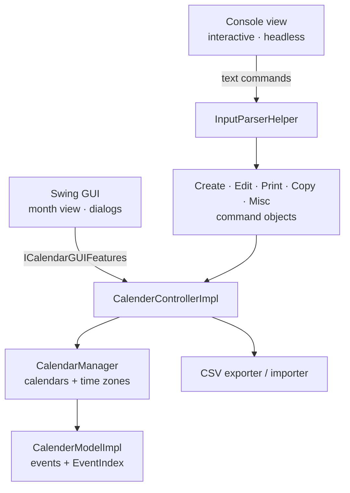
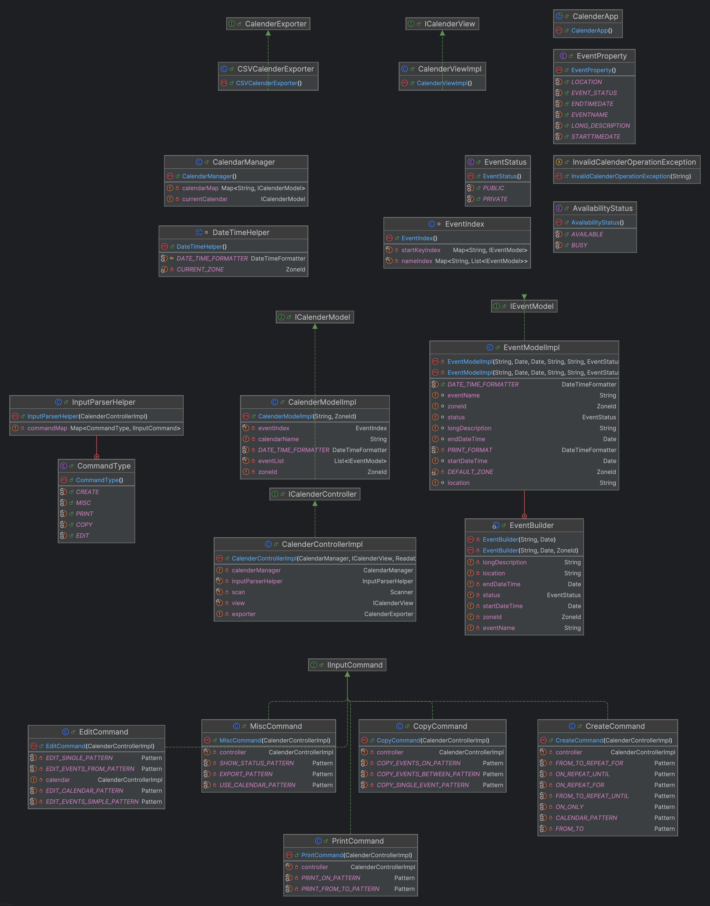
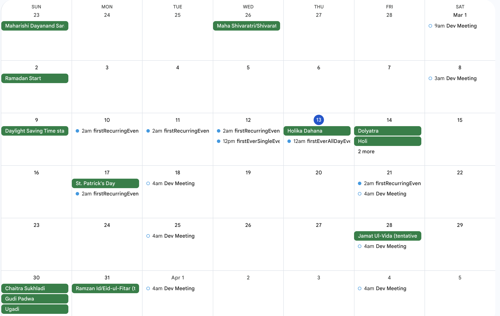

# Cross-Timezone Calendar

**A Java calendar application with a Swing GUI, an interactive console, and a scriptable
headless mode. It supports multiple calendars in different time zones, recurring events,
automatic conflict detection, cross-calendar copying with time-zone conversion, and
Google Calendar-compatible CSV export.**


The design follows MVC with the Command pattern, and a regular-expression parser routes
each text command to its own command object. The model is covered by 330 JUnit tests, with
PIT mutation testing configured. It was built as a two-person team project for CS5010
Programming Design Paradigm at Northeastern University.

## Features

- **Multiple calendars, each with its own time zone** (any IANA zone, such as
  `America/New_York` or `Asia/Kolkata`). Changing a calendar's zone converts its existing
  events.
- **Timed, all-day, and recurring events.** Events can repeat on chosen weekdays
  (`MTWRFSU`) for a number of weeks or until a date.
- **Conflict detection:** an event that overlaps an existing one is declined automatically.
- **Single and bulk edits:** change one event, every event with a given name from a date
  onward, or every event with that name.
- **Copy across calendars:** copy one event, a day, or a date range into another calendar,
  with times converted to the target calendar's zone.
- **Availability check:** `show status on <date-time>` reports `BUSY` or `AVAILABLE`.
- **CSV export and import** in Google Calendar's format. The screenshot below shows an
  export imported into Google Calendar.
- **Three front ends over one controller:** a Swing GUI (month view, navigation, day view,
  create, edit, and search dialogs, and CSV import and export), an interactive console, and
  a headless mode that runs a script of commands.

## Quick start

Requires Java 11 or newer. Download `calendar-app.jar` and `demo.txt` from the
[latest release](https://github.com/zoyaarief/Cross-Timezone-Event-Management-System/releases/latest), then:

```bash
java -jar calendar-app.jar                               # Swing GUI
java -jar calendar-app.jar --mode interactive            # type commands
java -jar calendar-app.jar --mode headless demo.txt      # run a script of commands
```

To build from source instead (no dependencies are needed to run it):

```bash
cd projectfinal/Assignment4
javac -d out $(find src/main/java -name "*.java")
java -cp out CalenderApp --mode headless res/demo.txt
```

### Sample session

Output from [`res/demo.txt`](projectfinal/Assignment4/res/demo.txt): a New York work
calendar, a recurring stand-up, a declined overlapping meeting, a bulk location edit, and a
copy into a London calendar that shifts every time by five hours.

```text
$ java -jar calendar-app.jar --mode headless res/demo.txt
Welcome to Calender App, please start by creating a new calendar
Calendar created: work
Calendar created: london
Now using calendar: work
Recurring event added: standup
Event added: design-review
Error: There is already a conflicting event --auto Declined
Successfully updated all events for standup
Event: standup | Start: 2025-07-07T09:00 | End: 2025-07-07T09:15 | Location: Zoom | Status: N/A
User is BUSY at 2025-07-08T14:15
Copied events between 2025-07-07 and 2025-07-09 to 2025-07-14 in calendar london
Now using calendar: london
Event: standup | Start: 2025-07-14T14:00 | End: 2025-07-14T14:15 | Location: Zoom | Status: N/A
Event: design-review | Start: 2025-07-15T19:00 | End: 2025-07-15T20:00 | Location: null | Status: N/A
```

## Command reference

Date-times use `yyyy-MM-ddTHH:mm` and dates use `yyyy-MM-dd`. Commands are case-insensitive.

| Command | Purpose |
|---|---|
| `create calendar --name <name> --timezone <Area/Location>` | Create a calendar |
| `edit calendar --name <name> --property <name\|timezone> <value>` | Rename it or change its time zone |
| `use calendar --name <name>` | Switch the active calendar (defaults to the most recently created one) |
| `create event <name> from <dt> to <dt>` | Timed event |
| `create event <name> on <date>` | All-day event |
| `create event <name> from <dt> to <dt> repeats <MTWRFSU> for <N> times` | Recurring event on the given weekdays for N weeks |
| `create event <name> from <dt> to <dt> repeats <MTWRFSU> until <dt>` | Recurring event until a date |
| `create event <name> on <date> repeats <MTWRFSU> for <N> times` / `until <date>` | Recurring all-day event |
| `edit event <property> <name> from <dt> to <dt> with <value>` | Edit one event |
| `edit events <property> <name> from <dt> with <value>` | Edit every event with that name starting at or after a date-time |
| `edit events <property> <name> <value>` | Edit every event with that name |
| `print events on <date>` | List the events on a day |
| `print events from <dt> to <dt>` | List the events in a range |
| `show status on <dt>` | `BUSY` or `AVAILABLE` |
| `copy event <name> on <dt> --target <calendar> to <dt>` | Copy one event |
| `copy events on <date> --target <calendar> to <date>` | Copy a day's events, converting the time zone |
| `copy events between <date> and <date> --target <calendar> to <date>` | Copy a range, converting the time zone |
| `export cal <file>.csv` / `import cal <file>.csv` | CSV export and import |
| `exit` | Quit |

Editable properties are `name`, `location`, `description`, `status` (`public` or
`private`), `startdatetime`, and `enddatetime`.

## Architecture



- **Model:** `CalendarManager` holds named calendars and the active one, and converts
  events when a calendar's zone changes. `CalenderModelImpl` stores events with an
  `EventIndex` (lookup by start time and by name), detects conflicts, and expands
  recurrences. `EventModelImpl` is built with a builder.
- **Controller:** `InputParserHelper` routes each command to a command object
  (`CreateCommand`, `EditCommand`, `PrintCommand`, `CopyCommand`, `MiscCommand`), and each
  one parses its own syntax with regular expressions. CSV import and export sit behind
  interfaces.
- **Views:** a console view for interactive and headless modes, and a Swing view that sends
  every user action to the controller through a features interface
  (`ICalendarGUIFeatures`) instead of changing the model itself.

<details>
<summary>UML class diagram</summary>



</details>



*A CSV export from the app, imported into Google Calendar.*

## Testing

330 JUnit 4 tests cover the model (calendar manager, event model, index, date-time
helper), the create, edit, print, and miscellaneous command parsers, the controller
including its GUI callbacks, CSV import, and the console view. PIT mutation testing is
configured in `pom.xml`.

```bash
cd projectfinal/Assignment4
mvn test
mvn test-compile org.pitest:pitest-maven:mutationCoverage   # mutation report in target/pit-reports
```

## Known limitations

- CSV export writes each event's subject, date, and time. The description, location,
  all-day, and privacy columns are left at their defaults, and times are written in
  `America/New_York` regardless of the calendar's zone.
- `repeats … for <N> times` counts weeks, so `MWF for 4 times` creates 12 events.

## Team

- **Zoya Arief:** edit commands (controller and model), edit and use calendar commands,
  controller tests, and integration tests
- **Siddhant Narode:** create, print, and copy commands, create calendar, and model and view
  tests
- Both: overall design and the controller

The original design notes, including the reasoning behind each design change, are in
[`res/README.md`](projectfinal/Assignment4/res/README.md).

## Project structure

```text
projectfinal/Assignment4/
├── pom.xml                    Maven build (JUnit 4, PIT)
├── res/                       Demo and sample command scripts, UML diagram, design notes
└── src/
    ├── main/java/
    │   ├── CalenderApp.java   Entry point: GUI, --mode interactive, --mode headless <file>
    │   ├── model/             Calendars, events, index, time-zone handling
    │   ├── controller/        Controller, command parsers, CSV import/export
    │   └── view/              Console view and Swing GUI
    └── test/java/             JUnit tests
```
